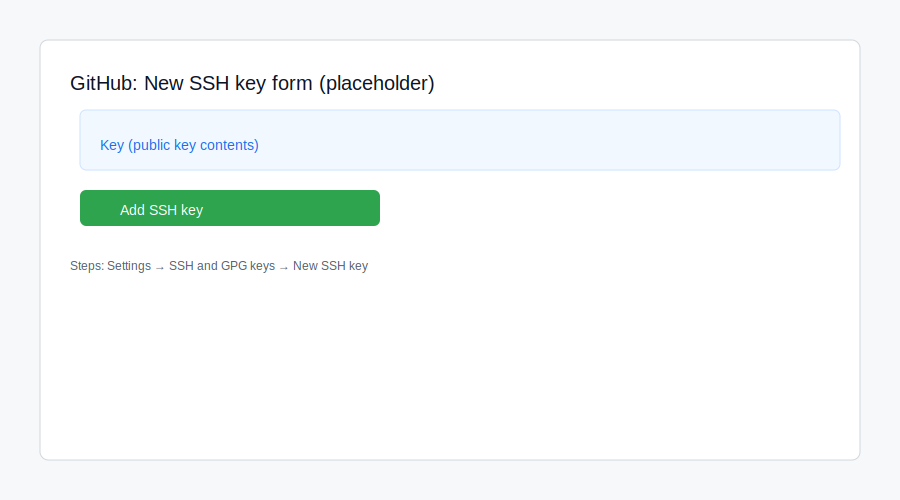

HOWTO: Add an SSH key to GitHub

This HOWTO shows the UI steps with screenshot placeholders.

1) Generate or locate your public key on your machine

- Check for an existing key:
  ls ~/.ssh/*.pub
- If none, generate one:
  ssh-keygen -t ed25519 -C "your_email@example.com"

2) Copy the public key

- Print it and copy the contents:
  cat ~/.ssh/id_ed25519.pub

3) Add the key in GitHub (UI)

- Open GitHub in a browser and sign in.
- Click your profile avatar (top-right) → "Settings".
- In the left menu click "SSH and GPG keys".
- Click the green "New SSH key" button.
- Paste the public key into the "Key" field.
- Title the key (e.g., "Work laptop") and click "Add SSH key".

Screenshot: (placeholder below)

4) Test the key locally

ssh -T git@github.com

Expected output:

Hi <your-username>! You've successfully authenticated, but GitHub does not provide shell access.

Notes

- If your key file is named differently, update the path accordingly.
- If you use a passphrase, add the key to the agent:
  eval "$(ssh-agent -s)"
  ssh-add ~/.ssh/id_ed25519
