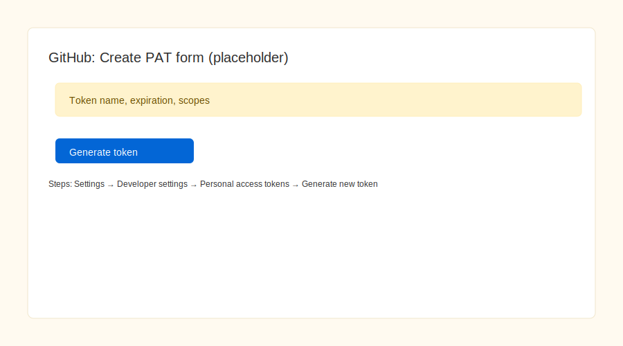

HOWTO: Create a Personal Access Token (PAT) and push via HTTPS

1) Create a PAT in the GitHub UI

- Sign in to GitHub.
- Click your avatar → Settings → Developer settings → Personal access tokens.
- Choose "Tokens (classic)" or "Fine-grained tokens" (fine-grained recommended).
- Click "Generate new token".
- Give the token a descriptive name, set an expiry, and select scopes:
  - For normal repo pushes: `repo`
  - For Actions access: add `workflow` or appropriate fine-grained permissions
- Click "Generate token" and copy the generated token value immediately.

Screenshot: (placeholder below)

2) Push using HTTPS with the PAT

- Configure the remote if needed:
  git remote remove origin 2>/dev/null || true
  git remote add origin https://github.com/<your-user>/<your-repo>.git

- Push to your branch:
  git push -u origin BRANCH

- When prompted for username: enter your GitHub username
- When prompted for password: paste the PAT

3) Optional: store the PAT locally (less secure)

- Use Git credential store (stores in plaintext):
  git config --global credential.helper store
  # Next push will prompt once and then cache the PAT

- Prefer using a credential manager appropriate for your OS for secure storage.
