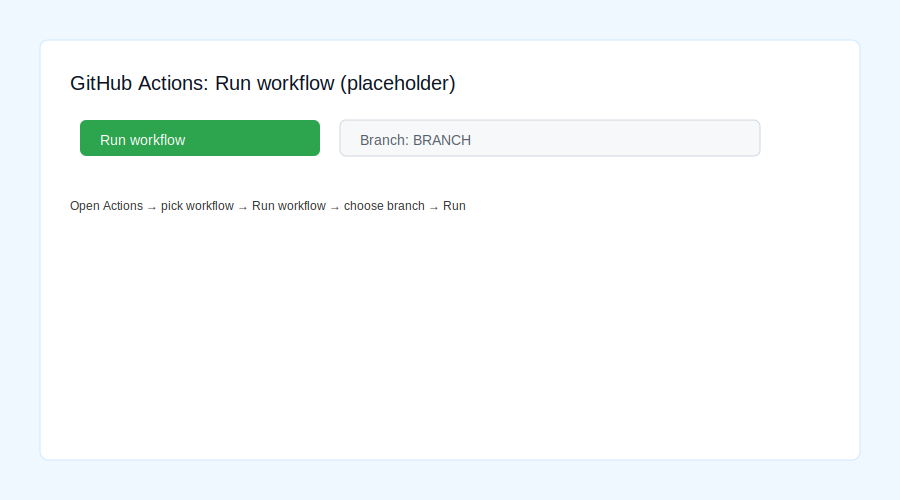
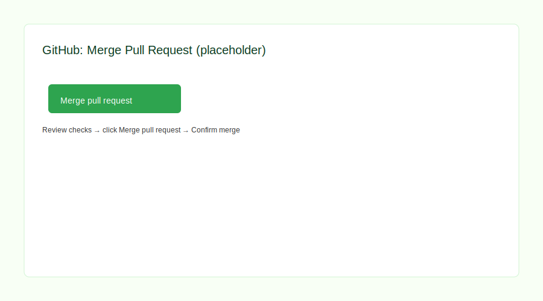

HOWTO: Run and merge workflows (Actions) and create PRs

1) Run a workflow manually (workflow_dispatch)

- Open the repository on GitHub.
- Click "Actions" in the top navigation.
- In the left sidebar click the workflow name (e.g., "CI").
- Click the green "Run workflow" button (top-right) if enabled.
- Choose the branch from the dropdown and click the green "Run workflow" in the modal.

Screenshot: (placeholder below)

2) View workflow run logs

- In Actions → select the workflow → click a run from the list.
- Click the job name (e.g., "test") to expand steps and view logs.
- Click any step to see detailed console output.

3) Create a Pull Request

- After pushing a branch, open the repo on GitHub.
- Click "Pull requests" → "New pull request".
- Set `base` to the target branch (e.g., `main`) and `compare` to your branch (e.g., `BRANCH`).
- Click "Create pull request", add a title/description, then click "Create pull request".

Screenshot: (placeholder below)

4) Merge a Pull Request

- Open the PR page.
- Review changes and checks.
- Click the green "Merge pull request" button.
- Confirm the merge commit message and click "Confirm merge".

Screenshot: (placeholder below)

5) Troubleshooting

- If you don't see the "Run workflow" button: ensure your workflow includes `workflow_dispatch` or the workflow file is present in the branch you're viewing.
- If checks fail: click the failing job → expand steps → read logs to identify errors.
